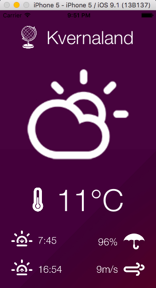
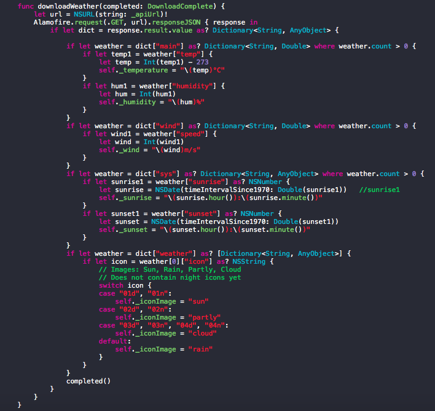
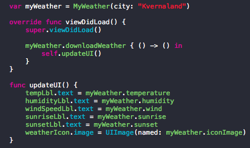

# myOpenWeather App
At the moment my hometown (Kvernaland) is hardcoded into the app. It is a parameter to the class initialiser, so it should be reusable. And a text input could probably been implemented.

Also there is no nightly icons in the app yet. But the rest is there, as you see from the screenshots.

Screenshots from the App.

The app

The download code

The UI update code
